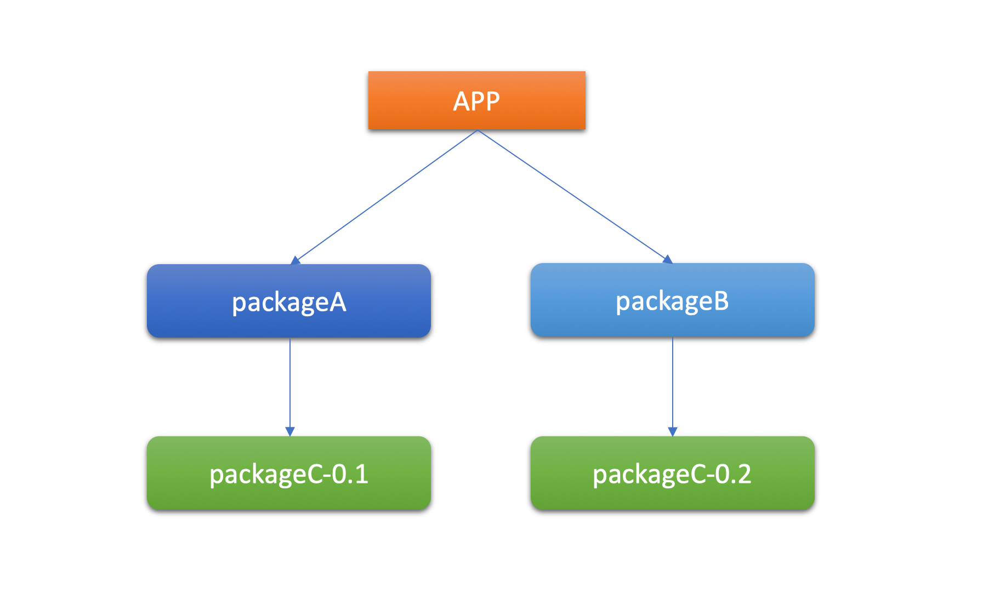
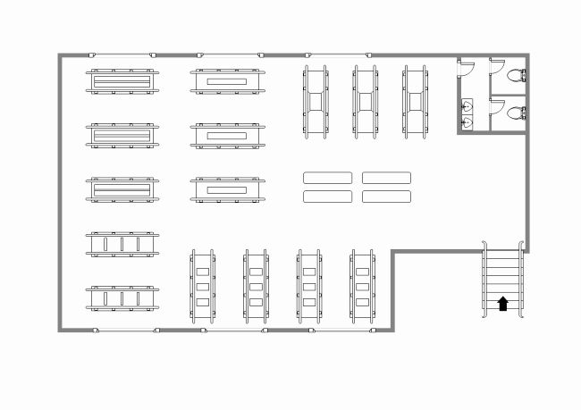

%Conda
%Raoul Bonnal and Marco Passaro
%5-6-7/10/2020

# Conda

##


> Package, dependency and environment management for any language---Python, R, Ruby, Lua, Scala, Java, JavaScript, C/ C++, FORTRAN


## Conda
Conda is an open-source package management system and environment management system that runs on Windows, macOS, and Linux.

1. Conda quickly installs, runs, and updates **packages** and their dependencies.
2. Conda easily creates, saves, loads, and switches between **environments** on your local computer.

. . .

> **PACKAGES** ???

> **ENVIROMENTS** ???

# Packages

## Packages
{width=300}

I am alone in an empty room and I want to paint "L'Urlo" by Munch.

----

What i need?

- Brushes
- Temperas
- Canvas
 
. . .

If you think the room where you are as the **computer** you are using, then the **Brushes**, **Temperas** and **Canvas** are the informatics tools you need to perform an operation. These informatics tools are distributed as **packages**.

. . .

> Basically a **package** refers to a compressed file archive containing all of the files that come with a particular tool/application.

----

{width=100}

Thinking again to the painting, because you need some objects to make it, you could say it **depends** by those objects.

. . .

In other words the painting has some **dependencies**.

----

In the same way every application that you need to use in your computers has some **dependencies** and you need to install them before running the application.

. . .

Moreover, every **dependencies** would in turn has other dependencies and so on...

. . .

We satisfy **dependencies** by installing **packages**.

----



# Environments

## Environments
In the same way the **packages** are represented by the  tools needed to do the **painting**, the "room" in which they are collected, in your computer is called **enviroment**.

. . .

> Simplifying the concept, an **environment** is the collection of all the informatics tools/application/librarires/variables that you, or other software, could access on your computer.

----

Now imagine that you want to build a car.

{width=600}

----

As seen before you will need new tools available in your room, such as:

1. screwdrivers
2. screws
3. wrenches

. . .

In other words to use a new software you often need to install new packages on your computer.

----

In your room you have **6 objects** and it is easy to find exactly what you need. 

. . .

After some times you are able to do all these things:
{}

. . .

- How many tools are inside the room?
- Is still easy to find and manage the tools you need?

----

In the same way when you install a lot of software in your computer a huge amount of packages are installed.

. . .

As a room full of abjects, the increasing complexity could create issues on your system. 

. . .

Any solutions for this?

----

Imagine to split out your room in many small rooms, and to put inside each of them only the tools you need to make a specific operation or to run a specific software.

. . .

In this way it will be simplier to manage and use the tools you need.

{width=500} {width=300} 

----

On your computer the multiple **rooms** are called **virtual environments**.

. . .

> A virtual environment is a tool that helps to keep dependencies required by different projects separate by creating isolated spaces for them that contain per-project dependencies for them.

# Conda (again)

## Conda (again)
Conda is an open-source package management system and environment management system that runs on Windows, macOS, and Linux.

1. Conda quickly installs, runs, and updates **packages** and their dependencies.
2. Conda easily creates, saves, loads, and switches between **environments** on your local computer.

. . .

So conda is:

- a packages manager
- an environments manager

# Conda Installation

## Conda installation
1. Download the installer

. . .

https://www.anaconda.com/products/individual


2. Run the installer

. . .

```bash
bash Anaconda-latest-Linux-x86_64.sh
```

4. Follow the prompts on the installer screens.

5. To make the changes take effect, close and then re-open your terminal window.

6. Test your installation running:

. . .

```bash
conda list
```

# Conda virtual environment

## Conda virtual environment
A conda virtual environment is a directory that contains a specific collection of conda packages that you have installed. 

. . .

For example, you may have one virtual environment with NumPy 1.7 and its dependencies, and another virtual environment with NumPy 1.6 for legacy testing.

. . .

If you change one virtual environment, your other virtual environments are not affected. 

. . .

You can also share your virtual environment with someonene else.

----

When you begin using conda, you already have a default environment named **base**. You don't want to put programs into your base environment, though. Create separate virtual environments to keep your programs isolated from each other.

. . .

1. Create a new virtual environment called **snowflakes**.

. . .

```bash
conda create --name snowflakes
```

2. Activate your new virtual environment

. . .

```bash
conda activate snowflakes
```

3. Install a new packages called **BioPython** in the virtual environment

. . .

```bash
conda install biopython
```
----

4. Conda checks to see what additional packages ("dependencies") BioPython will need, and asks if you want to proceed:

. . .

```bash
Proceed ([y]/n)? 
y
```
----

To visualize the list of packages that are actually installed on the active envinronment:

```bash
conda list
echo
mv text.txt text.png
cat
```
. . .

You should see **BioPython**

. . .

To exit from the **snowflakes** virtual environment and return to your **base** environment type:


```bash
conda deactivate
```

. . .

If you list again the installed packages you should **NOT** find any **ByoPython**

. . .

You could visualize all the virtual environments on your computer using:

```bash
conda env list
```

----

## Managing python
When you create a new environment, conda installs the same Python version you used when you downloaded and installed Anaconda.

If you want to use a different version of Python, for example Python 3.5, simply create a new environment and specify the version of Python that you want.

. . .

```bash
conda create --name snakes python=3.5
```
. . .

Activate it

```bash
conda activate snakes
```

----

Verify that the snakes environment has been added and is active:

```bash
conda env list
```
. . .

Verify the python version

```bash
python --version
```

Finally deactivate the virtual environment

```bash
conda deactivate
```

----

# Conda packages

## Conda packages
A conda package is a compressed tarball file (.tar.bz2) or .conda file that contains:

- system-level libraries
- Python or other modules
- executable programs and other components
- metadata under the directory
- a collection of files that are installed directly into an install prefix

----

1. To find a package you want to install, first activate the environmentin which you want to install it

. . .

```bash
conda activate snowflakes
```

2. Check to see if the package you want (**beautifulsoup4**) is available from the **Anaconda repository**

. . .

```bash
conda search beautifulsoup4
```

3. Install the package in the current environment

. . .

```bash
conda install beautifulsoup4
```

4. Check to see if the newly installed program is in this environment

```bash
conda list
```

# Conda channels

## Conda channels
Conda channels are the locations where packages are stored. They serve as the base for hosting and managing packages.

Conda packages are downloaded from remote channels, which are URLs to directories containing conda packages.

. . .

The conda command searches a default set of channels, and packages are automatically downloaded and updated from **https://repo.anaconda.com/pkgs/**.

----

When you installed the packages **BioPython** or **beautifulsoup4** before, they were taken from Conda default channels.

```bash
conda install bipython
```
. . .

The same is true for searching a specific package

```bash
conda search beautifulsoup4
```
----

You can modify what remote channels are automatically searched.

. . .

**Conda-forge** is a community channel made up of thousands of contributors.

. . .

To search for the package **scipy** in **conda-forge**

```bash
conda search scipy --channel conda-forge
```
. . .

You may specify multiple channels by passing the argument multiple times

```bash
conda search scipy --channel conda-forge --channel bioconda
```

----

You can now open your **snowflake** environemnt and install **scipy** from **conda-forge**

. . .

```bash
conda activate snowflakes
```
```bash
conda install scipy --channel conda-forge
```
```bash
conda list
```
```bash
conda deactivate
```

# Conda requirements file

## Conda requirements file
Once you have a conda virtual environment with packages installed inside, it is possible to create a **"requirements"** file to be used to boost the creation of a new virtual environments identical to the first.

. . .

Enter inside the **snowflakes** environment

```bash
conda activate snowflakes
```
. . .

Create the requirements file

```bash
conda list -e > requirements.txt
``` 
. . .

Deactivate the environment
```bash
conda deactivate
```
----

Now you could create a new environment using the **requirement.txt** file to tell conda which packages it has to install

```bash
conda create -n "snowflakes_copy" --file requirements.txt
```
. . .

Verify it

```bash
conda activate snowflakes_copy
```
```bash
conda list
```
. . .

Finally exit from the ennvironment

```bash
conda deactivate snowflakes_copy
```

# Conda useful commands

## Conda useful commands

Remove packages

```bash
conda remove PACKAGE_NAME
```
. . .

Remove environments (with all their packages)

```bash
conda env remove -n ENVIRONEMNT_NAME
```
. . .

Clone an environment
```bash
conda create --name MYCLONE --clone MYENV
```

# Jupyter notebook

## Jupyter notebook
The notebook provides a web-based application suitable for capturing the whole computation process: developing, documenting, and executing code, as well as communicating the results. The Jupyter notebook combines two components

1. **A web application**: a browser-based tool for interactive developing.

2. **Notebook documents**: a representation of all content visible in the web application, including inputs and outputs of the computations, explanatory text, mathematics, images, and rich media representations of objects.

----

Main features

- In-browser editing for code
- The ability to execute code from the browser
- Displaying the result of computation using rich media representations
- In-browser editing for rich text using the Markdown markup language

----

## Install Jupyter Notebook
First of all create a new environment called **jup_note** and activate it

. . .

Then install the package **notebook** from the channel **conda-forge**

. . .

```bash
conda create -n jup_note
conda activate jup_note
conda install notebook --channel conda-forge
```

## Running Jupyter Notebook
Inside the **jup_note** environment, activate jupyter notebook by typing:

```bash
jupyter notebook
```
. . .

This will print some information about the notebook server in your console, and open a web browser to the URL of the web application

# Jupyter and Conda

## Jupyter and Conda
With conda you can manage your packages and virtual environments.

With Jupyter notebook you have a powerful graphical tool for coding with **python 3**.

. . .

What about if i need to use **numpy** (a python module) in my jupyter notebook?

. . .

I have to install **numpy** in my **jup-note** virtual environment.

----

What about if i need to use **pandas** (a python module) in my jupyterotebook?

. . .

I have to install **pandas** in my **jup-note** virtual environment.

----

What about if i need to use **scanpy** (a python module) in my jupyterotebook?

. . .

I have to install **scanpy** in my **jup-note** virtual environment.

----

And so on for every package you need for all of your pipelines.

. . .

But in this way your **jup_note** environment will soon become full of packages generating conflicts.

----

Other question:

. . .

Waht about if i have to use in my jupyter notebook **numpy 1.19** (the current release) and then for another project i have to use numpy **1.12** (an older release)?

. . . 

Or if i want to use jupyter notebook with  **Python 2**?

# ipykernel

## ipykernel
The answer for all these questions is a package called ipykernel.

. . .

Basically it allows to create new **notebook kernel** for jupyter notebook from any conda virtual environment.

----

But what is a **notebook kernel**?

. . .

A **notebook kernel** is a **computational engine** that executes the code contained in a Notebook document.

. . .

> When you open a Notebook document, the associated kernel is automatically launched. When the notebook is executed (either cell-by-cell or with menu Cell -> Run All), the kernel performs the computation and produces the results. Depending on the type of computations, the kernel may consume significant CPU and RAM. 

---

In other words, the **jupyter kernel** is a sort of environment in which the code executed by the notebooks runs.

. . .

So you could create 

- a virtual environment for **numpy 1.19**
- a virtual environment for **numpy 1.12**
- a virtual environment for **python 2**.

. . .

and consequently create a 3 different kernels from them.

----

Once many kernels are generated, every time you create a new notebook, you could chose which kernel to use for it.

. . .

In other words you can chose in which virtual environemnt a notebook must run.

## Generating new kernels

1. Create a Conda environment

. . .

```bash
conda create --name numpy112
```

2. Activate the environment

. . .

```bash
conda activate numpy112
```

3. Install the package you need

. . .

```bash
conda install numpy==1.12.1
```
----

4. Install ipykernel

. . .

```bash
conda install ipykernel
```

5. Generate the new kernel from the activated virtual environment

. . .

```bash
python -m ipykernel install --user --name=numpy-1-12-1
```
----

Now exit from this environment and activate the **jup_note** environment.

. . .

Then start the jupyter notebook.

. . .

Comments?

## Try it!!!

Create a new **notebook kernel** with the latest version of python and the following packages and call it **course_python**.

- numpy
- pandas
- matplotlib
- seaborn
- scipy
- sklearn
- biopython
- networkx
- igraph

----

Create 2 new **notebook kernel**, the first for a specified version of **R** and the second fo your future **single cell sequencing analysis course** with **scanpy 1.6**.

Use the requirement.txt files provided for making these **kernels** and call them:

- R-version
- scanpy-version


